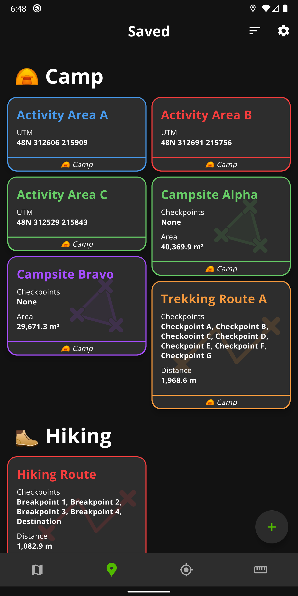
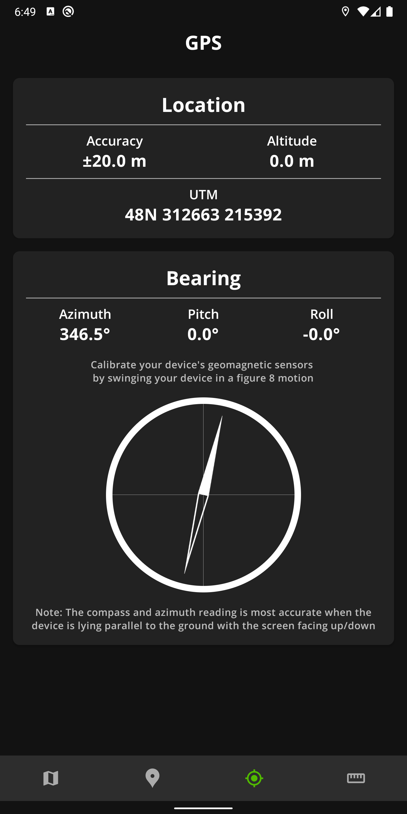

<p align="center">
  
</p>
<h1 align="center"><b><i>Recce</b></i></h1>

*Recce* is a *Map Planning and Navigation* app for Android. It supports 4 commonly-used geographic/projected coordinate systems (see [Supported GCS/PCS](#supported-gcspcs)) and offers coordinate transformations in real-time.

# Features

## 🗺️ Map

<p align="center">

</p>

*Recce* uses the Google Maps SDK (see [Libraries](#libraries)) to display a map for pinpointing and navigating. The Map lets you find the coordinate of any location in 4 different reference systems (see [Supported GCS/PCS](#supported-gcspcs)) down to 1m precision.

There are 3 map types available: *Normal*, *Satellite* and *Hybrid*. The Map also allows you to save points and plot routes and regions.

## 📍 Saved Pins

<p align="center">

</p>

The points, routes, and areas saved from the Map can be grouped, sorted and coloured to help organise your collection of points-of-interests.

## 🛰️ GPS

<p align="center">

</p>

The GPS page gives you convenient access to the coordinates of your current location, as well as a 3D compass with pitch, yaw, and roll for orientation.

## 📐 Ruler

<p align="center">

</p>

Saved points and routes can be added to the Ruler to compute cumulative and point-to-point direction and distance.

## Supported GCS/PCS

*Recce* offers the following GCS/PCS for displaying and inputting grids:
1. **WGS 84 (EPSG:4326)**. As used by Google Maps for coordinates.
2. **Universal Traverse Mercator (UTM)**. Automatic zone/band detection and conversion.
3. **Military Grid Reference System (MGRS)**. Only for UTM coverage, does not include UPS. Automatic zone, band, row letter and column letter detection and conversion.
4. **Kertau 1948**

Since *Recce* uses `Proj4J`, new systems can be added easily in the future (see [Libraries](#libraries))

# Installation

## Google Play Store

The most convenient method to install and start using *Recce* is by installing from the Google Play Store.

<p align="center">
<a href='https://play.google.com/store/apps/details?id=com.nujiak.recce&pcampaignid=pcampaignidMKT-Other-global-all-co-prtnr-py-PartBadge-Mar2515-1'></a>
</p>

<sup>Google Play and the Google Play logo are trademarks of Google LLC.<sup>

## Building

You can clone this repository and import into Android Studio.

```console
git clone https://github.com/nujiak/recce.git
```
Alternatively, you can create a new project directly in Android Studio by going to *File > New > Project from Version Control...* and using `https://github.com/nujiak/recce.git` as the URL.

**⚠️ Note: You will need to provide a Google Maps API key for the Google Maps SDK to work properly** (see [Google Maps API Key](#google-maps-api-key)).

# Configuration

## Google Maps API Key

You will need to provide a Google Maps API Key in order to use the Google Maps SDK. Follow the instructions on [Using API Keys](https://developers.google.com/maps/documentation/android-sdk/get-api-key) under the section *Creating API keys* to obtain an API key.

Create a string entry in `app/src/main/res/values/secrets.xml` with the name `google_maps_api_key`. You may have to create the file if it does not exist. Your `secrets.xml` should look like the following:

```xml
<?xml version="1.0" encoding="utf-8"?>
<resources>
    <string name="google_maps_api_key">YOUR_API_KEY_HERE</string>
</resources>
```
`YOUR_API_KEY_HERE` should be replaced with your API key obtained from Google Cloud Console.

# Contributing

You can contribute to *Recce* through the following workflow:

1. Fork this repo
2. Create your feature branch (`git checkout -b new-feature`)
3. Commit your changes (`git commit -m ...`)
4. *(Optional)* Run Mega Linter to ensure code quality
5. Push your branch (`git push origin new-feature`)
6. Open a Pull Request and make sure that it passes all checks.


# Libraries

*Recce* uses the following libraries:

1. [`Proj4J`](https://github.com/locationtech/proj4j) for coordinate transformations.
2. [`Google Maps SDK`](https://developers.google.com/maps/documentation/android-sdk/overview) for map display and pin plotting.
3. [`Dagger Hilt`](https://dagger.dev/hilt/) for dependency injection.
4. [`Room`](https://developer.android.com/jetpack/androidx/releases/room) for database abstraction.

Other libraries are also used that are not stated here. The full list of dependencies can be found in `app/build.gradle`.